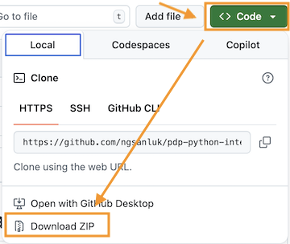
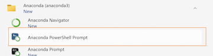
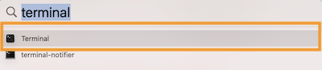
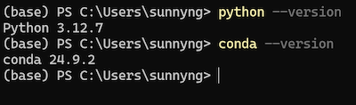
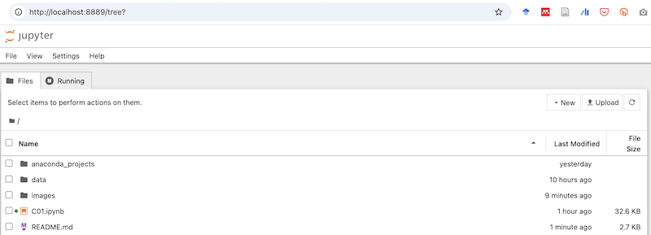
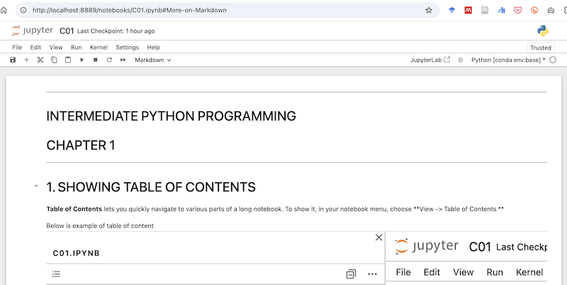

# PDP Intermediate Python Programming

## Introduction

This is an intermediate level python programming course for business students. You must have basic python knowledge. Pre-requisites include python variable, data type, string processing, use of operators, list processing, conditional processing, looping, advanced data types.

If you don't have above python knowledge, please check out the python introduction course below. You can download and self-learn introductory level of python programming skills by using Jupyter Notebook or Jupyter Lab.

[Python Intro](https://github.com/ngsanluk/PythonIntro-Answer)

## Topics of this Course

Following topics will be covered by this intermediate level of python programming. Students will use Jupyter Notebook or Jupyter Lab to browse notebooks and constantly practice python syntax aloneside intructor's teaching.

- Mastering Markdown
- Using Pandas
- Jupyter Notebook Keyboard Shortcuts
- IPython Magic Commands
- Pandas DataFrame
- Selecting Rows and Columns
- Tidying Data
- Aggregation Functions
- Groupby
- Merging Data
- Processing JSON Data
- Data Visualizaton With Matplotlib
- pandas built-in plots
- Using seaborn
- JSON Live Data Loading & Data Visualisation
- Concept of Web Scraping
- Introduction to HTML/CSS
- Using BeautifulSoup
- Introduction to Cloud Computing
- Introduction to AI Tools

## Required Software/Tools

- [Download Anaconda](https://www.anaconda.com/download)
- [Download Visual Studio Code](https://code.visualstudio.com/download)

## To Load This Jupyter Notebook Project

1. Download the sources codes

   

2. Unzip the project source codes

   In windows, double-clicking a zip file will only give a preview of contents in a zip file. Make sure you extract/zip the contents from the zip file before you move on to the next step.

3. Open command line interface

- For Windows, open **Apps -> Anaconda -> Anaconda PowerShell Prompt**
  
- For Mac, open **Terminal** app (you can use Spotlight to search Terminal app)
  

4. In the command line interface (Windows or Mac), type the following command to verify your anaconda installation

   ```
   python --version
   conda --version
   ```

   You should see outputs like below

   

5. In command line interface, type `cd`+`SPACE`
6. drag the folder that contains your downloaded source codes from Github. (dragging the folder will copy the **file path** of the source codes. It's usually a very long path name and that's why we drag it to copy the path name instead of type it letter by letter). In your terminal, the command should looks like below. (Note: `cd` stands for **c**hange **d**irectory)

   `cd C:\Users\sunnyng\Downloads\pdp-python-inter-main`

   Don't forget the **EMPTY SPACE** between `cd` and the **target folder name**

7. Press `ENTER` to confirm changing your working directory.
8. Type `pwd` (It shows **p**resent **w**orking **d**irectory) to double check if you are in the correct project directory.
9. type `jupyter notebook` to start jupyter notebook server from current working directory. A browser will automatically open
   up showing the Jupyter Notebook dashboard like below.
   

   You can alternatively type `jupyter lab` to use enhanced version of notebook. (JupyterLab and Jupyter Notebook are both interactive computing environments for working with Jupyter notebooks, but JupyterLab is a more advanced and flexible evolution of the classic Jupyter Notebook.)

   If you wish to stop the jupyter notebook server, press `CTRL` + `C` to quit the notebook server. (It works for both Windows and Mac)

10. Double-click at a notebook (files with extension **.ipynb**) to start learning and practicing python.
    

## Common CLI commands

| Command | Description                      | Examples                                                                                                                                                                                                     |
| ------- | -------------------------------- | ------------------------------------------------------------------------------------------------------------------------------------------------------------------------------------------------------------ |
| `pwd`   | present working directory        | `pwd`                                                                                                                                                                                                        |
| `ls`    | list the contents (file/folders) | `ls` <br> `ls -l` <br> `ls -la`                                                                                                                                                                              |
| `cd`    | change directory                 | `cd myfolder`: change to a subfolder named **myfolder** <br> `cd \`: change to the root folder of computer <br> `cd ~`: change to a user's home directory <br> `cd ..`: change to one-level-up parent folder |
| `clear` | clear the terminal screen        | `clear`                                                                                                                                                                                                      |
| `cat`   | display the contents of a file   | `cat myfile.txt`                                                                                                                                                                                             |

## Keyboard Shortcuts

### Shortcuts in _command mode_

| Key                                         | Function                                    |
| ------------------------------------------- | ------------------------------------------- |
| `Enter`                                     | enter _edit mode_ in the active cell        |
| `Cmd+Enter` (Mac) or `Ctrl+Enter` (Windows) | run and stay at the current cell            |
| `Up`                                        | to navigate to upper cell                   |
| `Down`                                      | to navigate to lower cell                   |
| `A`                                         | insert a new cell above the active cell     |
| `B`                                         | insert a new cell below the active cell     |
| `M`                                         | make the active cell a Markdown cell        |
| `Y`                                         | make the active cell a code cell            |
| `Shift` + `Up Arrow`                        | select the current cell and the cell above  |
| `Shift` + `Down Arrow`                      | select the current cell and the cell below  |
| `Ctrl` + `A`                                | select all cells                            |
| `X`                                         | cut the selected cell or cells              |
| `C`                                         | copy the selected cell or cells             |
| `V`                                         | paste the cell(s)                           |
| `Shift + M`                                 | merge multiple selected cells into one cell |
| `DD` (`D` twice)                            | delete the active cell                      |
| `Z`                                         | undo most recent command mode action        |

### Shortcuts in _edit mode_

| Key                         | Function                            |
| --------------------------- | ----------------------------------- |
| `Esc`                       | to enter _command mode_             |
| `Tab`                       | for code completion                 |
| `Shift` + `Tab`             | for tooltip help                    |
| `Ctrl` + `Shift` + `-`      | split the active cell at the cursor |
| `Ctrl` + `/` or `Cmd` + `/` | toggle comment                      |
